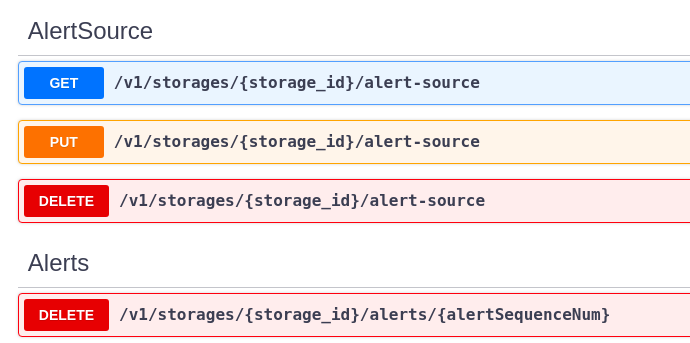
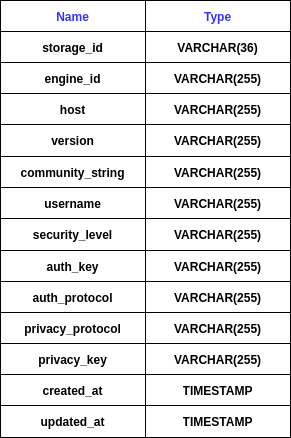
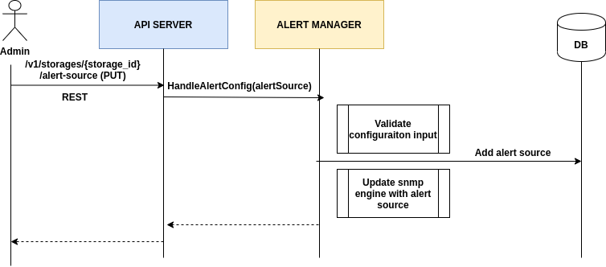
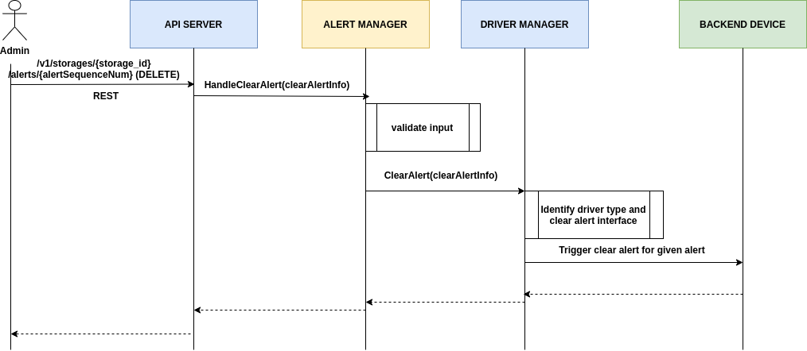

# SODA Alert Manager Design Document
**Authors:** [Sushantha Kumar](https://github.com/sushanthakumar), [Shufang Zeng](https://github.com/sfzeng)

This documentation serves as the design spec for Alert manager module of SODA Infrastructure Management
## Goal
This document will propose the key aspects of alert manager, its key requirements, interfaces, data model and low level design details involving sequence diagrams for major flows

## Non-Goals
This design does not cover the deployment model or the way in which this module will be installed with other modules of infra management framework 

## Assumptions and Constraints
* SNMP also supports informs which are similar to traps but need acknowledgement from the manager to ensure guaranteed delivery. This design does not consider the support for SNMP informs.
* SNMP v2c/v3 configuration need to be done at device side also which will be taken care by Administrator

## Requirement Analysis
### Input Requirements
| Id    | Description|
|-----------------|---------------------------|
| AlertMngr.IR.001        | Send alarms received from registered devices to third party managers |
| AlertMngr.IR.002     | Clear alarm specified by manager |
| AlertMngr.IR.003     | Manage alert source configuration |

### Feature Requirements
#### Functional Requirements
##### AlertMngr.Int.001 Support loading and parsing of trap MIB files
|  |  |
|-----------------|---------------------------|
| Brief Description    | Loading and parsing of trap MIB files from predefined mib files path |
| Precondition       | None |
| Input     | Trigger for Module startup  |
| Key Processings     | Load all the MIB files from a predefined path and parse |
|                     | Handle dependency of MIb on other MIBs |
|                     | Keep the parsed trap info for later processing |
| Output    | All the MIBs for defining traps are loaded/Parsed  |
| Priority     | High |
| Remarks     | None |

##### AlertMngr.Int.002 Process incoming SNMP traps
|  |  |
|-----------------|---------------------------|
| Brief Description    | Processing SNMP V2c/V3 traps received from devices |
| Precondition       | Trap server is running on given port |
| Input     | SNMP trap received at trap server  |
| Key Processings     | Validate incoming trap wrt its version |
|                     | Parse trap content using loaded MIB information |
|                     | Convert trap info to SODA Alert model |
|                     | Push alert to exporter for sending out |
| Output    | Trap is processed and alert is sent to exporter  |
| Priority     | High |
| Remarks     | By default, trap receiver is up and listening for traps |

##### AlertMngr.Int.003 Clear specified alarm
|  |  |
|-----------------|---------------------------|
| Brief Description    | Clearing particular alarm specified by user  |
| Precondition       | Module is up and alarms are received |
| Input     | Details of alarm to be cleared  |
| Key Processings     | Event received by alert config |
|                     | Parse and get details of alarm to be cleared |
|                     | Trigger alarm clear from back end |
| Output    | Input alarm is cleared at backend  |
| Priority     | High |
| Remarks     | None |

##### AlertMngr.Int.004 Add alert source configuration
|  |  |
|-----------------|---------------------------|
| Brief Description    | Configuring alert source for SNMP V2c/V3 user for processing traps |
| Precondition       | Module is up |
| Input     | Alert source configuration from admin  |
| Key Processings     | Validate input alert source wrt its version |
|                     | Add alert source details to DB |
|                     | Update trap receiver with alert source config |
| Output    | Input alert source is saved to database and trap receiver is updated accordingly to handle traps |
| Priority     | High |
| Remarks     | None|

##### AlertMngr.Int.005 List alert source configuration
|  |  |
|-----------------|---------------------------|
| Brief Description    | Listing all configured alert sources |
| Precondition       | Module is up |
| Input     | List alert source request from admin  |
| Key Processings     | Validate input query request |
|                     | Return the list of all alert sources from DB |
| Output    | List of all alert sources|
| Priority     | High |
| Remarks     | None|

##### AlertMngr.Int.006 Delete alert source configuration
|  |  |
|-----------------|---------------------------|
| Brief Description    | Deleting already configured alert source |
| Precondition       | Module is up |
| Input     | Delete Alert source configuration request from admin  |
| Key Processings     | Validate input alert source delete request |
|                     | Delete alert source details from DB |
|                     | Remove alert source config details from trap receiver side |
| Output    | Input alert source configuration is deleted from database |
| Priority     | High |
| Remarks     | None|

##### AlertMngr.Int.007 Update alert source configuration
|  |  |
|-----------------|---------------------------|
| Brief Description    | Updating existing alert source configuration |
| Precondition       | Module is up |
| Input     | Update Alert source configuration requestfrom admin  |
| Key Processings     | Validate input alert source wrt its version |
|                     | Update alert source details to DB |
|                     | Update trap receiver with alert source config |
| Output    | Input alert source is updated to database and trap receiver is updated accordingly to handle traps |
| Priority     | High |
| Remarks     | None|

#### Non Functional Requirements
NA

## Architecture Analysis
### High Level Module View
### High Level Module Architecture

#### Submodules
* Trap Receiver : Listens and handles incoming traps
* Alert Processor: Parses using MIB info, converts to soda model, sends to exporter
* Alert Config : Exposes external interface and handles config part

## Detailed Design
### Intermodule interaction diagram

### Interface Design
#### Interfaces consumed by Alert Manager
|  Provider | Interfaces |
|-----------------|---------------------------|
| Export Manager   | Name: PushAlertModel |
|                  | Description: To push soda alert module to third party |
|                  | Input: soda alert model |
|                  | Output: Success/Failure |
| Driver Manager   | Name: FillAlertModel |
|                  | Description: To process trap data and convert to soda alert model |
|                  | Input: trap data |
|                  | Output: Soda alert model |
| Driver Manager   | Name: HandleDeviceTrapConfig |
|                  | Description: To configure the parameters to send trap at device side |
|                  | Input: trap config para |
|                  | Output: Success/Failure |
| Driver Manager   | Name: ClearAlert |
|                  | Description: To clear the alert for the input sequence number from device side |
|                  | Input: alert sequence number |
|                  | Output: Success/Failure |

#### Interfaces exposed by Alert Manger
|  Consumer | Interfaces |
|-----------------|---------------------------|
| API server   | Name: HandleAlertConfig |
|              | Description: To process alert source configuration |
|              | Input: alert source configuration |
|              | Output: Success/Failure |
| API server   | Name: HandleClearAlert |
|              | Description: To process clear alert |
|              | Input: clear alert related data |
|              | Output: Success/Failure |

### Alert API model

Swagger Reference (https://github.com/sodafoundation/delfin/blob/master/openapi-spec/swagger.yaml)

### Data Model
* AlertSourceInfo: All the information about the alert source device which will be stored in DB

* AlertModel: Soda alert model which will be pushed to export manager after complete processing of trap 

### Sequence Diagrams

* Configuring alert source1

* Processing incoming traps

* Clearing alert

